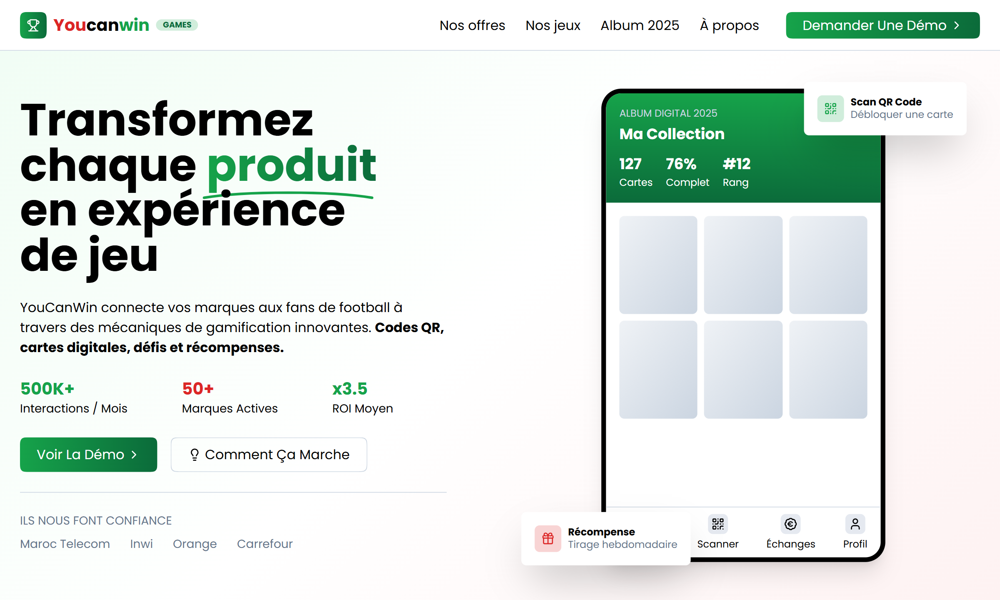
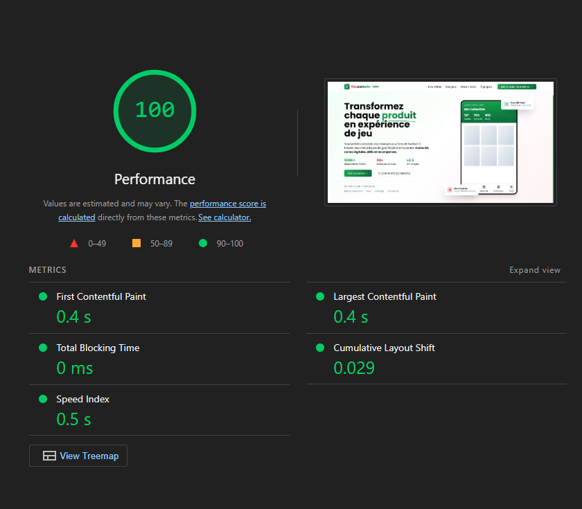

# YouCanWin @VOID

A modern, high-performance landing page. [View Live Site](https://void-youcanwin.vercel.app/)



## Table of Contents

- [Tech Stack](#tech-stack)
- [Features](#features)
- [Performance](#performance)
- [Installation](#installation)

## Tech Stack

- **Frontend:** React 18, TypeScript, Vite
- **Animations:** GSAP & Lenis (Smooth Scroll)
- **Styling:** Tailwind CSS (version 4)
- **Fonts & Icons:** Poppins, Lucide Icons

## Features

- Responsive and optimized for all screen sizes.
- The entire codebase is written in TypeScript for enhanced type safety and maintainability.
- Built with a strong emphasis on Core Web Vitals and accessible design principles.
- Performance Oriented: High Lighthouse scores.

## Performance

Measured with Google Lighthouse:

- **No Layout Shift:** Optimized CLS (Cumulative Layout Shift) for a stable visual experience.
- **Fast Loading:** Minimal LCP (Largest Contentful Paint) and FCP (First Contentful Paint) times.



## Installation

1. **Clone the repo**

   ```bash
   git clone https://github.com/EL-OUARDY/void_youcanwin.git
   cd void_youcanwin
   ```

2. **Install deps**

   ```bash
   npm install
   ```

3. **Run dev**
   ```bash
   npm run dev
   ```

## Owner

[Wadi3](https://wadi3.codes/) — Full Stack Developer
